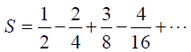

<h1>The <strong>C</strong> Programming Language Review</h1>
<ol>
 <li>Introduction to C:
    <ul>
      <li><code>helloWorld.c</code> - recives a string of characters, checks that the ones are not numbers</li>
      <li><code>arithmetic.c</code> - receives two integers via <i>stdin</i>,checks for the input data for integers and execute arithmetic operations</li>
      <li><code>max.c</code> - receives two integers via <i>stdin</i>, checks for the input data for integers and outputs the maximum value</li>
      <li><code>function.c</code> - receives one floating-point number, checks for the input data so the programm only receives numbers and displays
      result of calculating the function, which has <i>pow()</i> and <em>round()</em> math functions</li>
      <li><code>input_char.c</code> - keyboard input and console output of a single character. Cleaning the buffer from the inputted character <em>'\n'</em></li>
      <li><code>input_string.c</code> - keyboard input and console output of strings</li>
    </ul>
 </li>
 <li>Basic control structures, recursive, table:
    <ul>
      <li><code>prime_divisor.c</code> - finds the largest prime divisor of any predetermined integer, by using division and the operation of taking the remainder of the division</li>
      <li><code>prime_divisor_1948.c</code> - finds the largest prime divisor of any predetermined integer, WITHOUT using division and the operation of taking the remainder of the division</li>
      <li><code>sum_sequence.c</code> - finds the sum of the sequence  </li>
      <li><code>factorial.c</code> - finds the factorial using and without using a recursive algorithm</li>
      <li><code>fibonacci.c</code> - finds the a number from the Fibonacci sequence using and without using a recursive algorithm</li>
      <li><code>random.c</code> - generates a random value</li>
      <li><code>char_decode.c</code> - takes operation mode (0 - encoding / 1 - decoding) as a command-line parameter and accepts characters separated by a space and outputs encoded or decoded characters. A line break character is a sign of the end of the input</li>
    </ul>
 </li>
</ol> 
